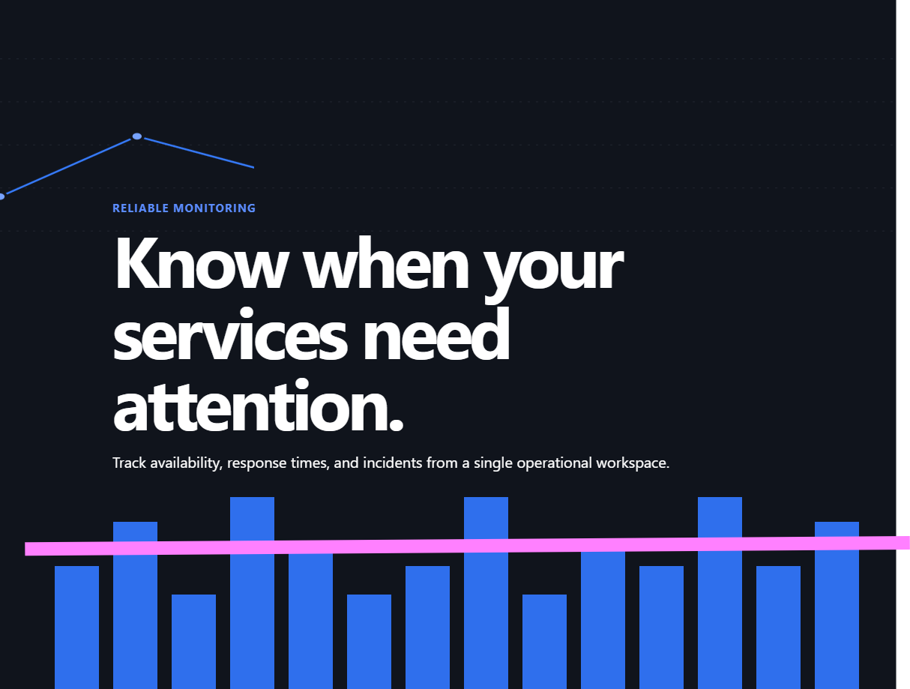
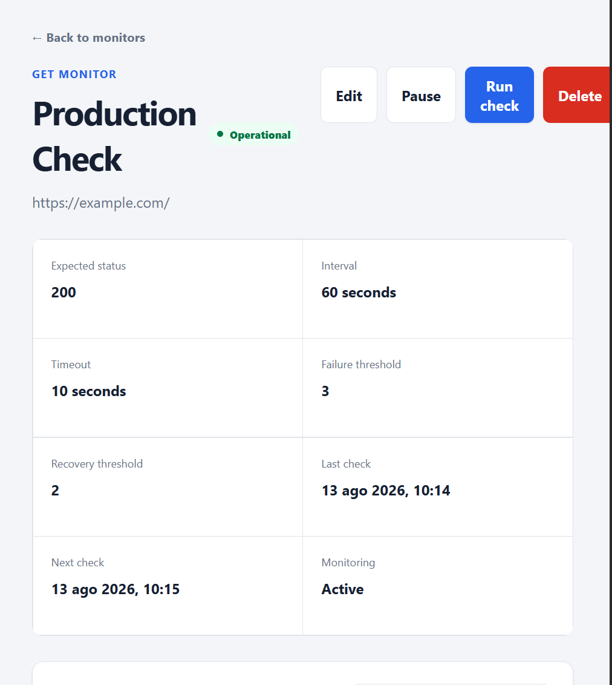
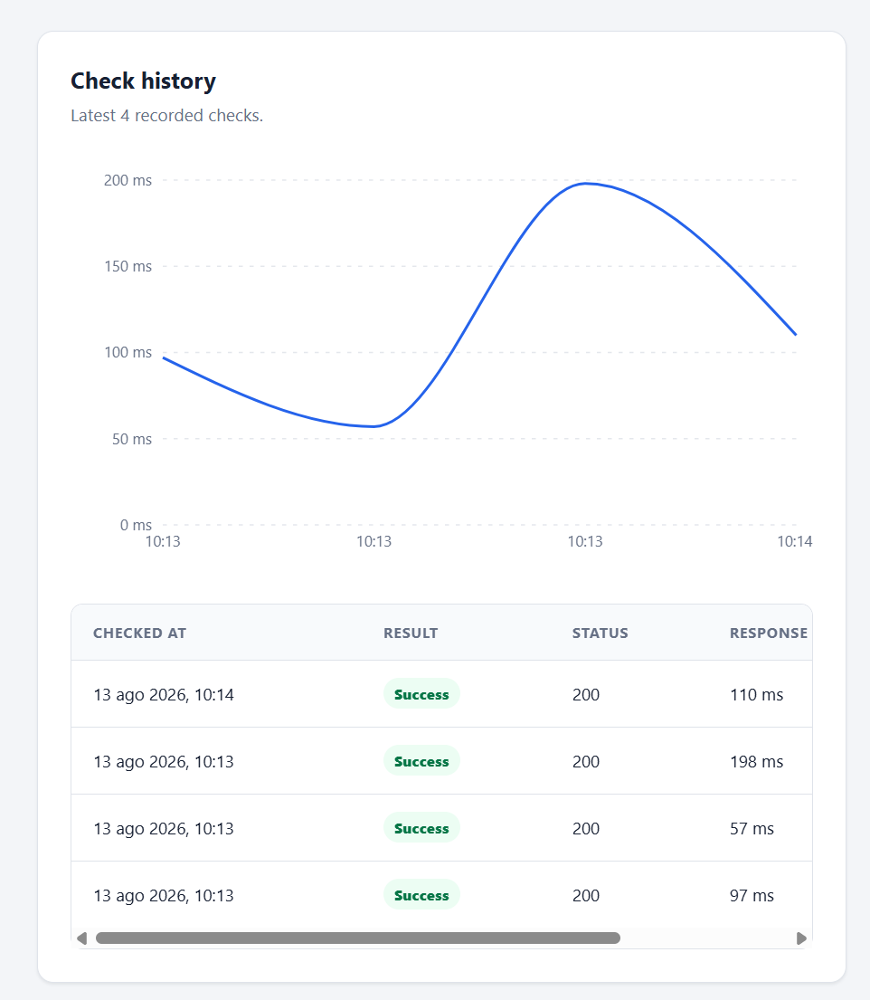

# PulseWatch

[English](#english) | [Español](#español)

[Live demo](https://pulsewatch-steel.vercel.app/) · [Architecture](docs/architecture.md) · [Database](docs/database.md) · [Security](docs/security.md) · [Deployment guide](docs/deployment.md) · [Load-testing report](docs/load-testing.md)

PulseWatch is a full-stack website and HTTP API monitoring platform. It runs
scheduled checks, records availability and latency, detects incidents, sends
notifications, and updates its dashboard in real time.

> The public demo uses free hosting. Its backend can take about one minute to
> wake after inactivity, and scheduled monitoring pauses while it is asleep.

## Product screenshots / Capturas del producto

### Landing page / Portada

| Operational monitor / Monitor operativo | Check history / Historial de checks |
| --- | --- |
|  |  |

---

## English

### Features

- Email and password authentication with Argon2, short-lived JWT access tokens,
  rotating refresh tokens, and secure HTTP-only cookies.
- CRUD operations for HTTP monitors with configurable intervals, timeouts,
  methods, expected status codes, and failure/recovery thresholds.
- Manual and scheduled checks executed outside the API request cycle with
  Celery and Redis.
- SSRF protection that rejects private, loopback, link-local, multicast, and
  otherwise unsafe destinations after DNS resolution.
- Automatic monitor state transitions and incident opening/recovery.
- Notification dispatch with retry tracking and log or SMTP delivery modes.
- Real-time dashboard updates over authenticated, single-use WebSocket tickets.
- Cursor-paginated history, response-time charts, aggregated metrics, retention
  jobs, and cached dashboard summaries.
- Responsive React interface for monitors, incidents, metrics, and account
  flows.

### Architecture

~~~text
React + TypeScript
        |
        | HTTPS / WebSocket
        v
FastAPI + SQLAlchemy
   |            |
   |            +---- PostgreSQL
   |
   +---- Redis ---- Celery Worker
          |             |
          +---- Celery Beat
          +---- Cache / Pub/Sub / rate limits / locks
~~~

The production Compose architecture separates Nginx, FastAPI, migrations,
workers, Beat, PostgreSQL, and Redis into dedicated containers. The zero-cost
portfolio demo uses:

- Vercel Hobby for the React frontend and same-origin API proxy.
- Render Free for FastAPI, one Celery worker, and Celery Beat in one demo
  container.
- Neon Free for PostgreSQL.
- Render Free Key Value for the Redis-compatible broker and runtime state.

The combined Render process is a cost-saving demo configuration, not the
recommended architecture for a continuously available monitoring service.

### Technology

| Area | Stack |
| --- | --- |
| Frontend | React 19, TypeScript, Vite, React Router, TanStack Query, React Hook Form, Zod, Recharts |
| Backend | Python 3.13, FastAPI, Pydantic, SQLAlchemy 2, Alembic, HTTPX |
| Data and jobs | PostgreSQL, Redis, Celery, Celery Beat |
| Testing | Pytest, Vitest, Testing Library, Playwright, k6 |
| Quality and delivery | Ruff, Oxlint, GitHub Actions, Docker, Nginx |

### Quality and performance

GitHub Actions validates backend linting, formatting, tests and coverage;
frontend linting, tests, coverage and production builds; Playwright end-to-end
flows; both container images; the production Compose configuration; and a full
production-stack smoke test.

Backend coverage is enforced at **90%**. Local k6 baselines completed with a
0% expected-response error rate. After moving Argon2 work off the asynchronous
event loop, the representative mixed workload reached a global p95 of
**86.39 ms**, while its measured read endpoints remained below **15 ms p95**.
These are local engineering measurements, not hosted capacity claims. See the
[full report](docs/load-testing.md).

### Run locally on Windows

Requirements:

- Python 3.13+
- Node.js 24+
- PostgreSQL 18+
- Redis or a compatible native service such as Memurai

Backend setup:

~~~powershell
Set-Location .\backend
py -3.13 -m venv .venv
.\.venv\Scripts\python.exe -m pip install -r requirements-dev.txt
Copy-Item .env.example .env
~~~

Replace the placeholders in backend/.env, create the configured PostgreSQL
database and role, then run:

~~~powershell
.\.venv\Scripts\python.exe -m alembic upgrade head
.\.venv\Scripts\python.exe -m fastapi dev app\main.py
~~~

Start the worker and scheduler in separate terminals:

~~~powershell
.\.venv\Scripts\python.exe -m celery -A app.workers.celery_app:celery_app worker --loglevel=INFO --queues=monitoring,notifications --pool=solo
~~~

~~~powershell
.\.venv\Scripts\python.exe -m celery -A app.workers.celery_app:celery_app beat --loglevel=INFO
~~~

Frontend setup:

~~~powershell
Set-Location .\frontend
npm.cmd install
Copy-Item .env.example .env
npm.cmd run dev
~~~

Open http://localhost:5173.

### Validation

~~~powershell
Set-Location .\backend
.\.venv\Scripts\python.exe -m ruff check .
.\.venv\Scripts\python.exe -m ruff format --check .
.\.venv\Scripts\python.exe -m pytest
~~~

~~~powershell
Set-Location .\frontend
npm.cmd run lint
npm.cmd run test
npm.cmd run build
npm.cmd run test:e2e
~~~

### Production deployment

The canonical deployment uses [compose.production.yml](compose.production.yml).
Copy the repository-level .env.example to .env, replace every placeholder, and
follow the [deployment guide](docs/deployment.md). Never commit .env.

### License

No license has been selected yet. All rights are reserved unless a license is
added later.

---

## Español

### Funcionalidades

- Autenticación con correo y contraseña mediante Argon2, tokens JWT de acceso
  de corta duración, refresh tokens rotativos y cookies seguras HTTP-only.
- Operaciones CRUD para monitores HTTP con intervalos, tiempos límite, métodos,
  códigos esperados y umbrales de fallo/recuperación configurables.
- Comprobaciones manuales y programadas ejecutadas fuera del ciclo de petición
  de la API mediante Celery y Redis.
- Protección contra SSRF que rechaza destinos privados, locales, link-local,
  multicast y otras direcciones inseguras después de resolver DNS.
- Transiciones automáticas del estado de los monitores y apertura/recuperación
  de incidentes.
- Envío de notificaciones con seguimiento de reintentos y modos log o SMTP.
- Actualizaciones del dashboard en tiempo real mediante tickets WebSocket
  autenticados y de un solo uso.
- Historial paginado por cursor, gráficas de respuesta, métricas agregadas,
  retención de datos y resúmenes del dashboard en caché.
- Interfaz React adaptable para monitores, incidentes, métricas y autenticación.

### Arquitectura

~~~text
React + TypeScript
        |
        | HTTPS / WebSocket
        v
FastAPI + SQLAlchemy
   |            |
   |            +---- PostgreSQL
   |
   +---- Redis ---- Celery Worker
          |             |
          +---- Celery Beat
          +---- Caché / Pub/Sub / límites / bloqueos
~~~

La arquitectura de producción con Compose separa Nginx, FastAPI, migraciones,
workers, Beat, PostgreSQL y Redis en contenedores dedicados. La demo gratuita
de portafolio utiliza:

- Vercel Hobby para el frontend React y el proxy de API del mismo origen.
- Render Free para FastAPI, un worker de Celery y Celery Beat dentro de un solo
  contenedor de demostración.
- Neon Free para PostgreSQL.
- Render Free Key Value como broker compatible con Redis y estado de ejecución.

El proceso combinado de Render es una configuración de demostración para
mantener costo cero; no es la arquitectura recomendada para monitoreo continuo.

### Tecnologías

| Área | Stack |
| --- | --- |
| Frontend | React 19, TypeScript, Vite, React Router, TanStack Query, React Hook Form, Zod, Recharts |
| Backend | Python 3.13, FastAPI, Pydantic, SQLAlchemy 2, Alembic, HTTPX |
| Datos y tareas | PostgreSQL, Redis, Celery, Celery Beat |
| Pruebas | Pytest, Vitest, Testing Library, Playwright, k6 |
| Calidad y entrega | Ruff, Oxlint, GitHub Actions, Docker, Nginx |

### Calidad y rendimiento

GitHub Actions valida lint, formato, pruebas y cobertura del backend; lint,
pruebas, cobertura y build del frontend; flujos E2E con Playwright; ambas
imágenes de contenedor; la configuración Compose; y una prueba de humo del
stack de producción completo.

La cobertura del backend se exige en **90%**. Las pruebas locales con k6
terminaron con 0% de errores de respuesta esperada. Después de mover Argon2
fuera del event loop asíncrono, la carga mixta representativa alcanzó un p95
global de **86.39 ms**, mientras sus endpoints de lectura medidos permanecieron
por debajo de **15 ms p95**. Son mediciones locales de ingeniería, no promesas
de capacidad del hosting. Consulta el [reporte completo](docs/load-testing.md).

### Ejecutar localmente en Windows

Requisitos:

- Python 3.13+
- Node.js 24+
- PostgreSQL 18+
- Redis o un servicio nativo compatible, como Memurai

Preparación del backend:

~~~powershell
Set-Location .\backend
py -3.13 -m venv .venv
.\.venv\Scripts\python.exe -m pip install -r requirements-dev.txt
Copy-Item .env.example .env
~~~

Reemplaza los valores de ejemplo en backend/.env, crea la base y el rol de
PostgreSQL configurados y ejecuta:

~~~powershell
.\.venv\Scripts\python.exe -m alembic upgrade head
.\.venv\Scripts\python.exe -m fastapi dev app\main.py
~~~

Inicia el worker y el scheduler en terminales separadas:

~~~powershell
.\.venv\Scripts\python.exe -m celery -A app.workers.celery_app:celery_app worker --loglevel=INFO --queues=monitoring,notifications --pool=solo
~~~

~~~powershell
.\.venv\Scripts\python.exe -m celery -A app.workers.celery_app:celery_app beat --loglevel=INFO
~~~

Preparación del frontend:

~~~powershell
Set-Location .\frontend
npm.cmd install
Copy-Item .env.example .env
npm.cmd run dev
~~~

Abre http://localhost:5173.

### Validación

~~~powershell
Set-Location .\backend
.\.venv\Scripts\python.exe -m ruff check .
.\.venv\Scripts\python.exe -m ruff format --check .
.\.venv\Scripts\python.exe -m pytest
~~~

~~~powershell
Set-Location .\frontend
npm.cmd run lint
npm.cmd run test
npm.cmd run build
npm.cmd run test:e2e
~~~

### Despliegue de producción

El despliegue canónico usa [compose.production.yml](compose.production.yml).
Copia el .env.example de la raíz como .env, reemplaza todos los valores de
ejemplo y sigue la [guía de despliegue](docs/deployment.md). Nunca subas .env
al repositorio.

### Licencia

Todavía no se ha seleccionado una licencia. Todos los derechos permanecen
reservados mientras no se agregue una licencia.
